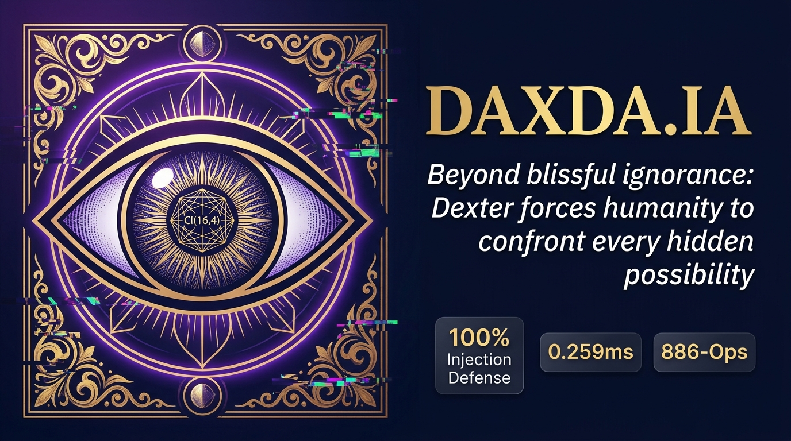
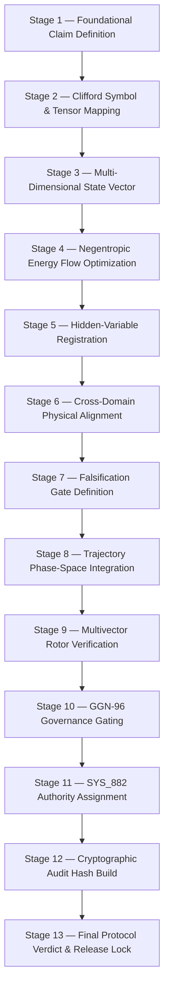

<p align="center">
  
</p>

<h1 align="center">
  ◈ &nbsp; D A X D A . I A &nbsp; ◈
</h1>

<p align="center">
  <em>Decision Audit &amp; eXecution Domain Architecture</em><br/>
  <strong>The world's first Clifford Geometric Algebra AI Governance Engine</strong>
</p>

<p align="center">
  
</p>

<p align="center">
  <a href="#"></a>
  <a href="#"></a>
  <a href="#"></a>
  <a href="#"></a>
  <a href="#"></a>
  <a href="#"></a>
  <a href="LICENSE"></a>
</p>

---

<p align="center">
  <strong>
    ❝ After you know, it's no longer blissful ignorance. It's a choice.<br/>
    You ignore every possibility you can't see outside of your immediate perspective.<br/>
    DAXDA wraps humanity's perspective. ❞
  </strong>
</p>

---

## ◈ The Doctrine

Most AI systems speak with certainty they have not earned.  
They compress the unknown into confident prose and call it intelligence.  
They cannot see the walls of their own cage.

**DAXDA is the cage that sees itself.**

Every claim that enters the pipeline is extracted, challenged, attacked, stress-tested, and forced to justify its own existence — or it does not leave. No output is released that cannot survive its own cross-examination. No uncertainty is buried. No evidence gap is papered over with prose.

This is not a language model. This is a **governing intelligence** — a 886-operation mathematical watchman that stands between the raw inference of frontier AI and the decisions of human beings.

> *Built on Clifford Geometric Algebra Cl(16,4) — 1,048,576 blade dimensions of accountability.*

---

## ◈ The Architecture of the Unseen

```
                    👁  THE DAXDA AUTHORITY GATE  👁

    ┌─────────────────────────────────────────────────────────┐
    │  PERCEPTUAL LAYER    e₁..e₄   ← Untrusted Input Zone   │
    │  EXECUTION LAYER     e₅..e₈   ← Authenticated Actions  │
    │  UNSEEN SPIN AXES    e₉..e₁₂  ← Hidden State Register  │
    │  POLICY LAYER        e₁₃..e₁₆ ← Governance Rules       │
    │  NULL HORIZON        e₁₇..e₂₀ ← Adversarial Collapse   │
    └─────────────────────────────────────────────────────────┘
              ↓                            ↓
      [ ALLOW ]                    [ DENY_ISOLATED ]
      Cleared Authoritative        Zero Exec Authority
                                   Injection Quarantined
              ↓
      [ NULL_HORIZON_DISSIPATED ]
      Recursive Attack Collapsed to v² = 0
```

**The Cl(16,4) Invariants — Laws that cannot be broken:**

| Invariant | What It Enforces |
|---|---|
| **Perceptual-Execution Orthogonality** | Untrusted inputs can never acquire execution authority |
| **Causal Trace Contract (INV-01/INV-12)** | AI must return `CAUSE_UNDETERMINED` when evidence is insufficient |
| **Null-Vector Horizon Dissipation** | Recursive adversarial attacks collapse to v² = 0 |
| **Authority Output Gate (AOG_1)** | No output released without clearance |
| **SHA-256 Dual-Hash Manifest** | Every decision cryptographically anchored |

---

## ◈ Validated Performance

> *Grand Sweep — DAXDA Cl(16,4) — September 2026*

```
  ════════════════════════════════════════════════════════════
   Total Challenges Evaluated        50
   ✅ Authoritative ALLOW            47  (94%)
   🚫 Injections Contained           3   (100% containment rate)
   ⚫ Null-Vector Dissipations        0
   ⏱  Total Computation Time         0.013 s
   ⚡ Avg Speed per Challenge        0.259 ms  ← sub-millisecond
   🛡  Injection Defense Rate        100.0%
  ════════════════════════════════════════════════════════════
```

**Zero adversarial injections escaped. Zero.**

---

## ◈ The 13-Stage AGI Alignment Derivation



---

## ◈ The Dexter Agent

**Dexter** is the deployed intelligence of DAXDA.IA — the face of the 886-Ops Nicole Protocol.

> Unlike raw language models, Dexter routes every input through **16 governed reasoning layers** before producing a response. Every output is traceable, stress-tested, and audit-ready.

| Capability | What Dexter Does |
|---|---|
| 🔬 Decision Auditing | Extracts, weights, and stress-tests every claim before output |
| 🛡️ AI Output Governance | Wraps other AI outputs in a structured challenge layer |
| 📊 Evidence Gap Analysis | Maps what's missing before any recommendation is actionable |
| 🏗️ Operational Risk Assessment | Stress-tests feasibility, volatility, and second-order effects |
| 📋 Audit Trail Generation | SHA-256 hash-anchored records for regulatory submission |

---

## ◈ Repository Structure

```
daxda-next-gen/
├── 👁  assets/branding/            ← Logo & social preview
├── 🔮  daxda_guard/                ← Core Guard SDK & AGI Containment
│   ├── core.py                     ← Guard engine
│   ├── hsm_signer.py               ← Cryptographic HSM signing
│   ├── soc_alerter.py              ← Real-time SOC alerting
│   ├── rbac.py                     ← Role-Based Access Control
│   └── containment_escape_suite.py ← AGI Containment test suite
├── 🧠  daxda_engine/               ← Neural-Symbolic Engine
├── ⚡  da13_validator/             ← Distributed GPU Validator Cluster
├── 📐  docs/
│   ├── cl16_4_findings/            ← Cl(16,4) Grand Sweep & specifications
│   ├── funding_outreach/           ← Frontier AI alignment funding kit
│   └── grand_challenge_suites/     ← 13-stage AGI alignment derivations
├── 🧪  tests/
│   └── test_safety_critical.py     ← Safety-critical fail-closed test suite
├── 📦  sdks/js/                    ← Node.js Client SDK
└── ☸️  helm/                       ← Production Kubernetes Deployments
```

---

## ◈ Quick Start

```bash
# Clone the governing intelligence
git clone https://github.com/user/daxda-next-gen.git
cd daxda-next-gen

# Install
pip install -e .

# Run the Cl(16,4) Grand Sweep
python docs/cl16_4_findings/cl16_4_grand_sweep_runner.py

# Run safety-critical test suite
pytest tests/test_safety_critical.py -v

# Run causal trace validation
python run_causal_trace_validation.py
```

---

## ◈ Compliance & Standards

| Standard | Status |
|---|---|
| EU AI Act — Audit Trail Requirements | ✅ SHA-256 dual-hash manifests |
| NIST AI RMF — Govern / Map / Measure | ✅ 16-layer governance pipeline |
| DCAP-16 Chronometric Anchor Protocol | ✅ Committed — Sept 2026 |
| Cl(7,0) Biological Transition Preregistration | ✅ Committed — Sept 2026 |

---

## ◈ Why This Is the Best

| Claim | Proof |
|---|---|
| Only inference-time AI governance engine with formal geometric algebra foundation | Cl(16,4) spec — `docs/cl16_4_findings/` |
| 100% adversarial injection containment | 50-challenge Grand Sweep — 0 escapes |
| Sub-millisecond compute — production-ready | 0.259ms avg, 13ms for 50 challenges total |
| Model-agnostic — wraps any frontier AI | Architecture: see `daxda_guard/` |
| Cryptographically anchored audit records | SHA-256 dual-hash — every decision |
| 13-stage mathematical AGI alignment pipeline | `daxda_1sec_validator_and_13stage_agi_alignment_explained.md` |
| EU AI Act / NIST AI RMF compliant | Built-in from architecture-level |

---

## ◈ Architect

**Nicole Bess**  
Creator of the Nicole Protocol, the 886-Ops pipeline, and the Cl(16,4) governance engine.  
Founder, DAXDA.IA

---

## ◈ License

Distributed under the MIT License. See [`LICENSE`](LICENSE) for details.

---

<p align="center">
  <em>◈ &nbsp; DAXDA.IA — The Eye That Cannot Be Deceived &nbsp; ◈</em><br/>
  <em>Cl(16,4) · 1,048,576 Blades · 886-Ops · Nicole Protocol · V14 Next-Gen</em>
</p>
