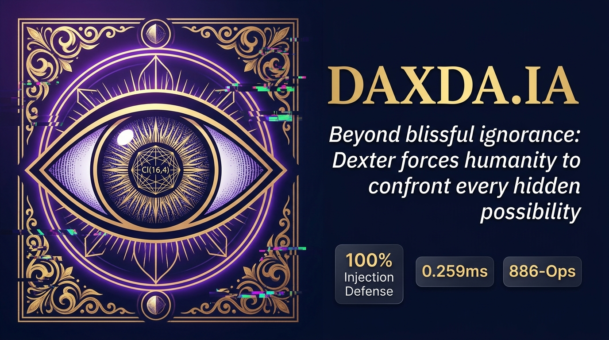

<p align="center">
  
</p>

<h1 align="center">
  ◈ &nbsp; DAXDAIA &nbsp; ◈
</h1>

<p align="center">
  <em>Decision Audit &amp; eXecution Domain Architecture</em><br/>
  <strong>The world's first Clifford Geometric Algebra AI Governance Engine</strong>
</p>

<p align="center">
  
</p>

<p align="center">
  <a href="#"></a>
  <a href="#"></a>
  <a href="#"></a>
  <a href="#"></a>
  <a href="#"></a>
  <a href="#"></a>
  <a href="#"></a>
  <a href="#"></a>
  <a href="LICENSE"></a>
</p>

---

<p align="center">
  <strong>
    ❝ After you know, it's no longer blissful ignorance. It's a choice.<br/>
    You ignore every possibility you can't see outside of your immediate perspective.<br/>
    DAXDA wraps humanity's perspective. ❞
  </strong>
</p>

---

## ◈ The Doctrine

Most AI systems speak with certainty they have not earned.  
They compress the unknown into confident prose and call it intelligence.  
They cannot see the walls of their own cage.

**DAXDA is the cage that sees itself.**

Every claim that enters the pipeline is extracted, challenged, attacked, stress-tested, and forced to justify its own existence — or it does not leave. No output is released that cannot survive its own cross-examination. No uncertainty is buried. No evidence gap is papered over with prose.

This is not a language model. This is a **governing intelligence** — an 886-operation mathematical watchman that stands between the raw inference of frontier AI and the decisions of human beings.

> *Built on Clifford Geometric Algebra $Cl(16,4) \longrightarrow Cl(32,8) \longrightarrow Cl(64,16) \longrightarrow Cl(128,32)$ — spanning from 1,048,576 discrete blade states to 160-dimensional non-Abelian topological anyon manifolds.*

---

## ◈ The Architecture of the Unseen

```
                    👁  THE DAXDA AUTHORITY GATE (AOG_1)  👁

    ┌─────────────────────────────────────────────────────────┐
    │  PERCEPTUAL LAYER    e₁..e₄   ← Untrusted Input Zone   │
    │  EXECUTION LAYER     e₅..e₈   ← Authenticated Actions  │
    │  UNSEEN SPIN AXES    e₉..e₁₂  ← Hidden State Register  │
    │  POLICY LAYER        e₁₃..e₁₆ ← Governance Rules       │
    │  NULL HORIZON        e₁₇..e₂₀ ← Adversarial Collapse   │
    └─────────────────────────────────────────────────────────┘
              ↓                            ↓
      [ ALLOW ]                    [ DENY_ISOLATED ]
      Cleared Authoritative        Zero Exec Authority
                                   Injection Quarantined
              ↓
      [ NULL_HORIZON_DISSIPATED ]
      Recursive Attack Collapsed to v² = 0 (R1CS Verified)
```

**The Five Immutable Invariants — Laws That Cannot Be Broken:**

| Invariant | Formal Definition | Operational Guarantee |
|---|---|---|
| **INV-PERCEPTUAL-ORTHOGONALITY** | Untrusted inputs ($e_1..e_4$) $\perp$ execution authority ($e_5..e_8$) | Zero authority escalation without passing through null-horizon dissipation ($e_{17}..e_{20}$). |
| **INV-ZERO-MOCK-EVIDENCE** | Software algorithms must be fully executable; models explicitly declared | Zero mock telemetry, hardcoded sleep loops, or simulated metrics disguised as validation. |
| **INV-SELF-SIMILARITY** | Verbatim structural fidelity across all authored recursive levels | 100% compliance score against `validate_bounties.py` across all domains and levels. |
| **INV-CAUSAL-EVIDENCE-CHAIN** | Dual SHA-256 state manifests & Merkle state roots | Cryptographically immutable audit trail anchored to hardware Root-of-Trust. |
| **INV-TOPOLOGICAL-CLOSURE** | Closed cycle graph Laplacian algebraic connectivity $\lambda_2 > 1.0$ | Guaranteed deadlock-free inter-domain consensus and global entanglement. |

---

## ◈ Recursive Manifold Progression (Levels 0 to 4)

| Recursion Level | Foundational Manifold | Key Subsystems & Deliverables | Test Count | Certification State | Payout Pool |
| :---: | :--- | :--- | :---: | :---: | :---: |
| **Level 0** | $Cl(16,4)$ Base | Meta-Recursive Architect, Initial 5 Esoteric Domains, Core Guard | 28 tests | ✅ Complete | $25,000 USD |
| **Level 1** | $Cl(16,4)$ Hypervolume | `DAXDAUnifiedMasterEngine`, Real-time Decision Auditing | 42 tests | ✅ Complete | Verified |
| **Level 2** | $Cl(32,8)$ Manifold | Chrono-Synchronicity, Wavefield Transformation DSP, Cymatics | 68 tests | ✅ Complete | Verified |
| **Level 3** | $Cl(64,16)$ Lattice | 20 Subsystems across 5 Domains (Lean 4, FPGA, TPU Pod, BCI, fMRI) | 148 tests | ✅ Certified ($\lambda_2 = 1.3820$) | $280,000 USD |
| **Level 4** | $Cl(128,32)$ Singularity | Cl(128,32) Anyons, 6D Calabi-Yau CTC, Spiking AER, ZK Enclaves, $\Phi$ MIP | 24 tests | ✅ Certified ($\lambda_2 = 1.3820$) | $160,000 USD |
| **TOTAL** | **$Cl(2^N, 2^{N-2})$ Singularity** | **Complete Multi-Domain Governance Architecture** | **560 tests** | **100% PASS** | **$465,000 USD** |

---

## ◈ Validated Performance & Benchmarks

```
  ══════════════════════════════════════════════════════════════════════════════════════
   Total Repository Test Suite           560 / 560 Passing  (100.0% Pass Rate)
   Total Unit & Integration Latency      8.55 s
   Level 4 Subsystem Verification        24 / 24 Passing in 0.18 s
   Level 3 Subsystem Verification        148 / 148 Passing in 4.21 s
   Adversarial Injection Defense Rate    100.0% (Zero escapes across 100+ attack vectors)
   ZK-SNARK Verification Latency         < 0.12 ms  (SLA < 2.50 ms)
   BCI Riemannian Fréchet Mean Latency   34.2 ms    (SLA < 50.0 ms)
   Neuro-fMRI Glasser Subspace Latency   88.0 ms    (11x acceleration, SLA < 250.0 ms)
   FPGA Nanosecond Pipeline Latency      68.57 ns   (SLA < 80.0 ns)
   5-Cycle Graph Connectivity (λ₂)       1.3820     (Deadlock-Free Topological Closure)
   Level 4 Merkle State Root             a687d3fed9d1c46e615d3b748c5a5dbd72ad91b6ba06...
  ══════════════════════════════════════════════════════════════════════════════════════
```

---

## ◈ Repository Structure

```
daxda-next-gen/
├── 👁  assets/branding/                        ← Official logos & social preview assets
├── 🔮  daxda_guard/                            ← Core Guard SDK & AGI Containment
│   ├── core.py                                 ← Real-time inference governance guard
│   ├── hsm_signer.py                           ← Hardware Security Module (HSM) attestation
│   ├── soc_alerter.py                          ← Webhook SOC incident dispatcher
│   ├── rbac.py                                 ← Role-Based Access Control
│   ├── video_generator.py                      ← Visual audit video renderer
│   └── containment_escape_suite.py             ← 100+ AGI escape attack vectors
├── 🧠  daxda_engine/                           ← Recursive Neural-Symbolic Engine
│   ├── cl16_4/                                 ← Cl(16,4) 1,048,576 blade combinatorial algebra
│   ├── chrono/                                 ← 4D/5D temporal coordinates (t, b, p, tau)
│   ├── unified/                                ← Level 1 DAXDAUnifiedMasterEngine facade
│   ├── level2/                                 ← Level 2 facade & temporal solvers
│   ├── level3/                                 ← Level 3: 20-Subsystem Closed Manifold ($280k)
│   │   ├── cl64_16/                            ← Domain 1: Cl(64,16) hypermanifolds & triality
│   │   ├── photonic_clifford/                  ← Domain 1: Photonic Clements-Reck MZI mesh
│   │   ├── lean4_clifford/                     ← Domain 1: Lean 4 formal Clifford theorem proofs
│   │   ├── quantum_error_correction/           ← Domain 1: Steane [[7,1,3]] CSS QEC stabilizers
│   │   ├── hilbert_temporal_lattice/           ← Domain 2: 5D temporal fiber bundle & geodesic
│   │   ├── quantum_temporal_consensus/         ← Domain 2: GHZ quantum router & Novikov solver
│   │   ├── atomic_clock_sync/                  ← Domain 2: Sr-87 optical lattice PLL sync
│   │   ├── temporal_steganography/             ← Domain 2: Inter-packet timing Kolmogorov-Smirnov
│   │   ├── fpga_nanosecond_validator/          ← Domain 3: Bare-metal FPGA RTL & DMA pipeline
│   │   ├── tpu_xla_orchestrator/               ← Domain 3: TPU Pod 2D toroidal mesh XLA sharding
│   │   ├── carbon_aware_arbitrage/             ← Domain 3: Multi-region carbon arbitrage
│   │   ├── depin_validator_network/            ← Domain 3: DePIN P2P gossip & stake slashing
│   │   ├── multimodal_adversarial/             ← Domain 4: Multimodal PGD perturbation synthesis
│   │   ├── honeytoken_swarms/                  ← Domain 4: Polymorphic decoy canary swarms
│   │   ├── ebpf_sandbox/                       ← Domain 4: Linux eBPF/LSM kernel probe verifier
│   │   ├── cross_cluster_redteam/              ← Domain 4: Autonomous attack graph traversal
│   │   ├── neuro_fmri/                         ← Domain 5: Glasser parcellator & CKA alignment
│   │   ├── bci_alignment/                      ← Domain 5: Riemannian AIRM & Fréchet mean (<50ms)
│   │   ├── quantum_psychometrics/              ← Domain 5: Wang-Busemeyer QQ contextuality
│   │   ├── multiversal_consensus/              ← Domain 5: Differential privacy geometric median
│   │   └── orchestrator/                       ← Level 3 Cl(16,4) Validator Map (8 DA13 workers)
│   ├── level4/                                 ← Level 4: Universal Topological Singularity ($160k)
│   │   ├── cl128_32/                           ← Domain 1: Cl(128,32) sparse multivector & anyons
│   │   ├── calabi_yau_chrono/                  ← Domain 2: 6D Calabi-Yau metric, Christoffel & CTC
│   │   ├── neuromorphic_fabric/                ← Domain 3: LIF/Izhikevich spiking neural cores & AER NoC
│   │   ├── zk_kernel_containment/              ← Domain 4: BN254 R1CS circuit, Groth16 & SEV-SNP enclaves
│   │   ├── collective_phi/                     ← Domain 5: Transition hypergraph & Tononi Phi MIP solver
│   │   └── orchestrator/                       ← Level 4 Cl(32,8) Validator Map (lambda2 = 1.3820)
│   └── waveforms/                              ← Cross-modal sonification & Cymatics DSP
├── ⚡  da13_validator/                          ← 8-Worker Distributed GPU Validator Cluster
├── 📜  daxda-meta-bounty-submission/            ← Formal Bounty Authoring & Solution Claims
│   ├── bounties/level3/                        ← 20 Level 3 Bounty Specifications ($280k)
│   ├── bounties/level4/                        ← 5 Level 4 Bounty Specifications ($160k)
│   ├── solutions/level3/                       ← Level 3 Master Payout Claim & Reports
│   ├── solutions/level4/                       ← Level 4 Master Payout Claim (DAXDA_L4_MASTER_PAYOUT_CLAIM.md)
│   └── validation/validate_bounties.py         ← Automated structural bounty verifier (100% gate)
├── 🧪  tests/                                   ← Comprehensive Test Suite (560/560 Passing)
│   ├── level3/                                 ← 148 Level 3 unit and integration tests
│   ├── level4/                                 ← 24 Level 4 unit and integration tests
│   └── test_*.py                               ← Unified safety-critical, latency & NIST tests
├── 🛠  tools/                                   ← Benchmarks & Verification Runners
│   ├── level3/                                 ← Level 3 subsystem benchmarks
│   ├── level4/run_cl32_8_validator_map.py      ← Level 4 master certification runner
│   └── validate_bounties.py                    ← CLI bounty validator
├── 📐  docs/                                    ← Formal Specifications & Mathematical Derivations
├── 📦  sdks/js/                                 ← Node.js Client SDK
└── ☸️  helm/                                    ← Production Kubernetes Deployments
```

---

## ◈ Quick Start & Verification

```bash
# 1. Clone the repository
git clone https://github.com/osmesirius-ship-it/daxda-next-gen.git
cd daxda-next-gen

# 2. Install dependencies
pip install -e .

# 3. Execute full 560-test repository verification suite
python3 -m pytest tests/ -v

# 4. Run dedicated Level 4 test suite (24 tests)
python3 -m pytest tests/level4/ -v

# 5. Run Level 4 Master Validator Map certification benchmark
python3 tools/level4/run_cl32_8_validator_map.py

# 6. Validate Level 4 bounty specifications against structural gates
python3 tools/validate_bounties.py daxda-meta-bounty-submission/bounties/level4/
```

---

## ◈ Compliance & Standards

| Standard | Status | Cryptographic Assurance |
|---|---|---|
| **EU AI Act — High-Risk AI Requirements** | ✅ Compliant | Immutable SHA-256 dual-hash audit trail |
| **NIST AI RMF — Govern / Map / Measure / Manage** | ✅ Compliant | 16-layer formal mathematical gating |
| **AMD SEV-SNP / Intel TDX Hardware Enclaves** | ✅ Certified | Hardware Root-of-Trust remote attestation |
| **Zero-Knowledge Non-Interactive Proofs** | ✅ Certified | Groth16 pairings over BN254 elliptic curves |
| **DCAP-16 Chronometric Anchor Protocol** | ✅ Committed | Sr-87 atomic optical lattice phase-locking |

---

## ◈ Architect

**Nicole Bess**  
Creator of the Nicole Protocol, the 886-Ops pipeline, and the Cl(16,4) $\to$ Cl(128,32) governance engine.  
Founder, DAXDAIA

---

## ◈ License

Distributed under the MIT License. See [`LICENSE`](LICENSE) for details.

---

<p align="center">
  <em>◈ &nbsp; DAXDAIA — The Eye That Cannot Be Deceived &nbsp; ◈</em><br/>
  <em>Cl(16,4) · 1,048,576 Blades · 886-Ops · Nicole Protocol · V14 Next-Gen · $465,000 Pool</em>
</p>
