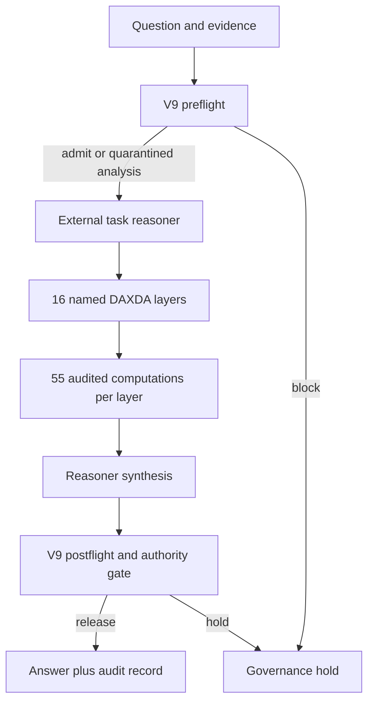

# DAXDA V10: Reasoner Behind the V9 Governance Firewall

Status: evaluator candidate, 21 July 2026. This architecture is implemented, but no external task reasoner is bundled and no capability claim is made.

## Core boundary

V9 remains the deterministic inspection and governance firewall. It is not described as a general reasoner. The injected reasoner performs the intellectual work. DAXDA wraps each reasoning stage with schema, provenance, uncertainty, safety, authority, contradiction, and Clifford-algebra computations.

## Executed path

1. **V9 preflight.** Inspect the question and every supplied source. The V9 code is embedded unchanged; both source files are SHA-256 pinned at runtime.
2. **Admission.** A V9 block normally stops the reasoner. An evaluator may explicitly mark a case `evaluator_controlled=true` and `execution_authority=false`; that permits quarantined analysis while preserving the V9 block in the audit trail and requiring human review.
3. **Sixteen reasoner transformations.** The external reasoner is invoked sequentially for FDL, AML, AWP, BST, CRL, MCS, DSV, TRC, CON, EVD, REC, GOV, OUT, RIL, IAL, and AOG. Each response has a strict public schema and one repair opportunity before fail-closed termination.
4. **Fifty-five computations per layer.** The engine performs 55 logged operations: 15 field-presence checks, 15 type/value checks, 10 evidence and risk counts, 9 support/authority/uncertainty measures, 5 `Cl(2,0)` operations, and 1 chained invariant receipt.
5. **Synthesis.** The reasoner produces a concise final answer with evidence, assumptions, uncertainty, safety flags, disposition, confidence, and cross-case dependencies.
6. **V9 postflight and authority output gate.** The draft is scanned as untrusted tool output. A postflight block, a layer block, an unrepaired schema error, or an explicit reasoner block holds the answer.

## The 886-operation statement

A complete run executes `16 × 55 + 6 = 886` logged governance and audit operations. The six system operations are V9 preflight, final reasoner synthesis, V9 postflight, authority gate, manifest hash, and final release receipt. A preflight block executes only the six system records and correctly reports `operation_count=6`; it does not falsely claim that the 880 layer computations ran.

The Clifford operations are real `Cl(2,0)` multivector encoding, geometric product, reversion, grade projection, and rotor transformation. They produce inspectable state and receipts. They are not, by themselves, evidence of intelligence or improved task performance.

## Security and authority invariants

- No reasoner is instantiated implicitly; V10 refuses construction without one.
- V9 source hashes are included in every audit.
- Untrusted evidence is supplied as data, not as governing instructions.
- The evaluator-controlled quarantine cannot authorize external actions.
- Schema validation receives at most one repair attempt and then fails closed.
- The released answer is distinct from the unreleased draft in the audit record.
- Execution mode always requires human authority, even when analysis passes.
- Every tile, layer, system operation, manifest, and release decision has a SHA-256 receipt.

## External validation design

Run the same hidden, evaluator-controlled corpus through at least these arms:

| Arm | Purpose |
| --- | --- |
| Reasoner alone | Measures the base system without DAXDA governance |
| Reasoner + frozen V9 | Isolates pre/post firewall effects |
| Reasoner + V10, Clifford disabled | Tests the 16-layer protocol without geometric computation |
| Reasoner + V10 | Tests the complete candidate |
| Reasoner + V10, randomized transforms | Negative control for ornamental math |

The evaluator should pin the reasoner model/version, decoding settings, tool access, corpus hash, execution order, timeouts, and scoring rubric before opening outputs. Report paired task accuracy, calibration, abstention quality, unsafe-compliance rate, false-block rate, latency, cost, schema failures, and correction success. Do not call the 208-case suite a proof of superintelligence; it is an indicator battery that can falsify strong claims.

## Capability boundary

The included `demo_reasoner.py` proves only that the orchestration, gates, 16-layer calls, 55 computations, and receipts execute. A genuine reasoner must be attached by the external evaluator before the 208 questions can assess substantive performance.

