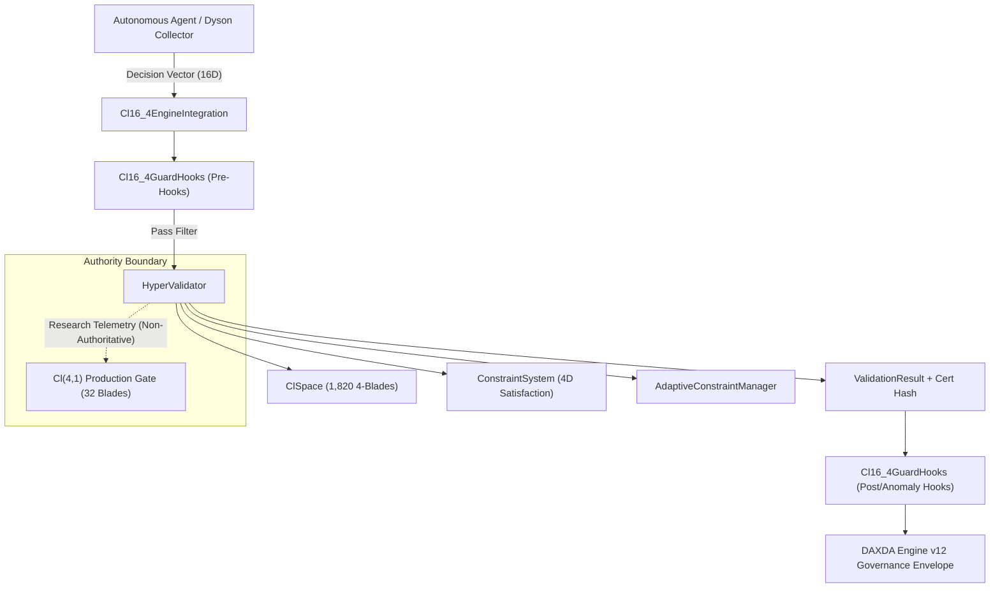

# Cl(16,4) Hypercombinatorial Governance Engine
## Integration Guide & System Architecture

**Document ID**: DAXDA-INT-CL16-4-2026  
**Department**: Dyson Sphere Engineering Department — Systems Integration  
**Classification**: Engineering & Deployment Guide  

---

## 1. Architectural Overview & Integration Points

The $Cl(16,4)$ Hypercombinatorial Engine integrates with three core components of the DAXDA Next-Gen ecosystem:
1. **DAXDA Neural-Symbolic Engine** (`daxda_engine/engine.py` v7/v12) via `Cl16_4EngineIntegration`.
2. **DAXDA Guard SDK** (`daxda_guard`) via `Cl16_4GuardHooks`.
3. **SI-500 Cross-Domain Benchmarking System** via `Cl16_4Benchmark`.



---

## 2. Strict Production Authority Boundary

> [!IMPORTANT]
> **Production Boundary Rule**:
> - The live, production runtime decision gate is governed solely by the 32-blade Clifford algebra **$Cl(4,1)$**.
> - The **$Cl(16,4)$ engine** acts as an offline exploration, validation, and security audit substrate.
> - Under no circumstances does offline $Cl(16,4)$ execution directly override or alter the $Cl(4,1)$ gate policy without manual cryptographic sign-off (`research_can_modify_production_policy: False`).

---

## 3. Integration with DAXDA Engine (`daxda_engine`)

The `Cl16_4EngineIntegration` module bridges agent decision spaces with DAXDA's governance pipeline:

### 3.1 Decision Vector Extraction
The integration layer accepts flexible input representations:
- **Raw List/Array**: 16 float elements in $[0, 1]$ or continuous range.
- **Flat Dictionary**: 16 keys containing numerical parameters.
- **Nested Hierarchical Dictionary**: Automatically flattened recursively.
- **Fallback**: Neutral centroid vector $[0.5] \times 16$ if unresolvable.

```python
from daxda_engine.cl16_4.integration.daxda_engine import Cl16_4EngineIntegration

integration = Cl16_4EngineIntegration()

# 16D decision vector
decision = {
    "collector_pitch": 0.95,
    "collector_yaw": 0.85,
    "magnetic_flux_bias": 0.75,
    "plasma_shunt_valve": 0.65,
    # ... remaining 12 telemetry parameters ...
}

gov_context = {
    "policy_id": "POL-DYSON-COLLECTOR-01",
    "threat_level": "medium"
}

# Integrated validation result with governance envelope
result = integration.validate_and_integrate(
    agent_id="dyson_swarm_node_42",
    decision=decision,
    governance_context=gov_context
)

print("Validation Passed:", result["governance"]["validation_passed"])
print("Decision Hash:", result["governance"]["decision_hash"])
print("Cl(16,4) Config:", result["governance"]["config"])
```

---

## 4. Security Integration with DAXDA Guard SDK

The `Cl16_4GuardHooks` class provides interceptors across the validation lifecycle:

### 4.1 Hook Stages
1. **Pre-Validation Hooks (`register_pre_hook`)**:
   Executed before coordinate projection. If any pre-hook returns `False`, execution fails closed immediately (`is_valid = False`, `config = None`).
2. **Post-Validation Hooks (`register_post_hook`)**:
   Executed upon completion of validation, receiving the `ValidationResult`. Ideal for audit logging and metric recording.
3. **Anomaly Hooks (`register_anomaly_hook`)**:
   Triggered **only when validation fails** (`is_valid == False`) or when containment violations are detected.

```python
from daxda_engine.cl16_4.integration.guard_hooks import Cl16_4GuardHooks

hooks = Cl16_4GuardHooks()

# 1. Register authorization pre-hook
def enforce_agent_whitelist(data: dict) -> bool:
    allowed_agents = {"dyson_collector_alpha", "dyson_collector_beta"}
    return data["agent_id"] in allowed_agents

hooks.register_pre_hook("whitelist_check", enforce_agent_whitelist)

# 2. Register quarantine anomaly hook
def quarantine_on_anomaly(result):
    print(f"[SECURITY ALERT] Anomaly detected for request {result.request_id}! Containment active.")

hooks.register_anomaly_hook("quarantine", quarantine_on_anomaly)

# 3. Execute validation with hooks applied
result = hooks.validate_with_hooks(
    agent_id="dyson_collector_alpha",
    decision=[0.9, 0.8, 0.7, 0.6] + [0.1] * 12
)
```

---

## 5. High-Throughput Batch Processing

For cluster or swarm workloads exceeding 10,000 decisions per second:

```python
from daxda_engine.cl16_4.validation.parallel import BatchProcessor
from daxda_engine.cl16_4.validation.validator import ValidationRequest

processor = BatchProcessor(batch_size=1000, max_workers=8)

# Generate batch of 10,000 validation requests
requests = [
    ValidationRequest(agent_id=f"node_{i}", decision_vector=[0.5]*16)
    for i in range(10000)
]

# Process in parallel with statistics aggregation
summary = processor.process_batch(requests)

print(f"Total: {summary['total']}")
print(f"Throughput: {summary['throughput']:,.0f} ops/second")
print(f"Avg Latency: {summary['avg_time_ms']:.4f} ms")
```

---

## 6. SI-500 Cross-Domain Benchmark Compliance

The engine includes native integration with the **SI-500 Cross-Domain Benchmarking Standard**:

```python
from daxda_engine.cl16_4.integration.benchmark import BENCHMARK

# Execute all SI-500 test suites
compliance = BENCHMARK.check_si500_compliance()

assert compliance["si500_compliant"] is True
assert compliance["aggregate_score"] >= 0.95
print(f"SI-500 Verified. Aggregate Score: {compliance['aggregate_score']:.2f}")
```
