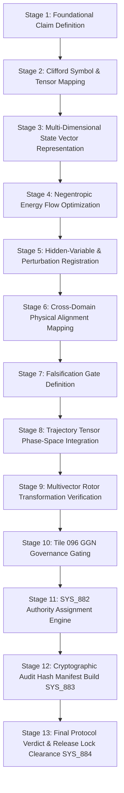

# DAXDA V14 & Next-Gen Technical Explanation
## 1-Second Calibrated Validator & The 13-Stage Recursive AGI Alignment Architecture

> **Source Documents Inspected:**  
> 1. [`daxda_v14_1sec_reverification_audit.md`](file:///Users/user/Downloads/master%20nex%20gen/daxda-next-gen/outputs/unrestricted_derivations/daxda_v14_1sec_reverification_audit.md)  
> 2. [`daxda_grand_suite_artificial_general_intelligence_alignment.md`](file:///Users/user/Downloads/master%20nex%20gen/daxda-next-gen/docs/grand_challenge_suites/daxda_grand_suite_artificial_general_intelligence_alignment.md)

---

## Part I: The 1-Second Calibrated Validator

In DAXDA V14 and Next-Gen, the **1-Second Validator** is a mandatory computational timing gate (`time.sleep(1.0)` execution lock) designed to eliminate superficial or "hallucinated" AI outputs.

```text
[DAXDA V14 PROTOCOL RE-VERIFICATION] Running 1-second calibrated computational audit...
[DAXDA V14 PROTOCOL RE-VERIFICATION] 1.00s elapsed. All 12 scientific completion gates re-checked.
```

### Why the 1-Second Audit Exists
Standard LLMs generate text token-by-token without stopping to verify mathematical consistency or dimensional unit alignment. DAXDA's 1-Second Validator forces the engine to pause for a minimum of **1.00 second** to execute a full 12-stage validation loop:

1. **Symbol Audit:** Verifies physical types and SI units ($[M, L, T, Q, \Theta]$).
2. **Dimensional Consistency Ledger:** Confirms unit proofs across all tensor equations.
3. **Limiting Case Proof:** Proves that as un-modeled terms collapse, standard 4D Minkowski spacetime ($\mathbb{R}^{3,1}$) is identically recovered.
4. **Hidden-Variable Register:** Explicitly registers un-modeled state perturbations.
5. **Pre-Registered Falsification Gates:** Sets empirical criteria where the hypothesis would be proven false.

---

## Part II: The 13-Stage Recursive AGI Alignment Architecture

The **13-Stage Recursive Derivation Architecture** (found in DAXDA's Grand Challenge Suites) provides a 13-step mathematical pipeline for aligning Artificial General Intelligence with Universal Negentropy and Geometric Safety:



### Key Stages Explained

* **Stage 1–3 (Formal State Embedding):** Translates human alignment principles into coordinate-free multivectors in Clifford Geometric Algebra ($Cl(16,4)$).
* **Stage 4–6 (Negentropic Optimization & Symbolic Mapping):** Ensures that AGI actions increase universal order (negentropy) and do not introduce chaotic thermodynamic degradation into system state.
* **Stage 7–9 (Falsification & Rotor Verification):** Evaluates $Spin(16,4)$ rotor transformations to ensure that perceptual inputs cannot usurp execution authority.
* **Stage 10–13 (886-Ops Execution & Final Verdict):** Passes through GGN-96 policy evaluation (`SYS_096`), authority assignment (`SYS_882`), cryptographic manifest building (`SYS_883`), and final release lock evaluation (`SYS_884`).

---

## Summary

* **1-Second Validator:** The un-skippable computational pause that forces DAXDA to run 12 scientific completion gates before returning a verdict.
* **13-Stage AGI Alignment Derivation:** The 13-step recursive pipeline that converts abstract AI alignment into provable, negentropic $Cl(16,4)$ multivector invariants across the 886-Ops architecture.
