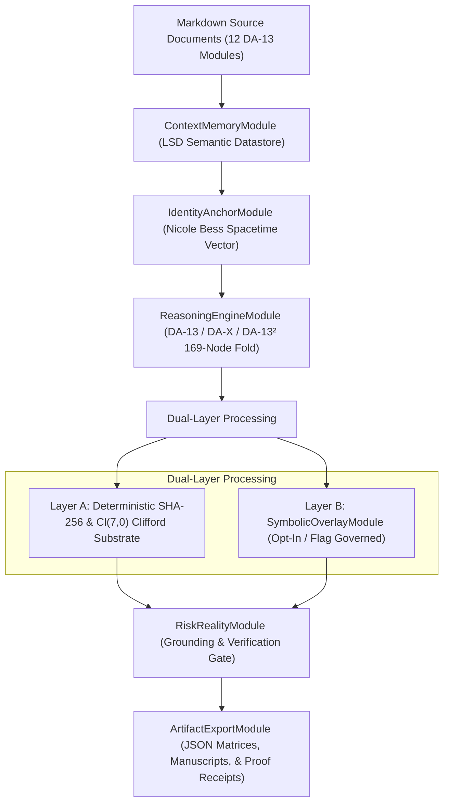

# DAXDA Next-Gen: Ingestion & Governance Specification for DA-13 Markdown Modules

## Overview

This specification documents how **DAXDA Next-Gen** (operating on the Nicole Protocol v0.3 / $Cl(7,0)$ 128-Blade Multivector Architecture) processes, governs, and synthesizes information from the **12 Core DA-13 Markdown & Cipher Analysis Modules**:

1. **DA-13 Symbolic Overlay**
2. **Personal Context Analysis**
3. **Alternative Hash Analysis**
4. **Unseen Correlations**
5. **Nicole Bess 13-Layer Cascade**
6. **Comprehensive Documentation**
7. **Eschatological Convergence Analysis**
8. **ChatGPT Cipher Analysis**
9. **Ascension Analysis & GIFs**
10. **SHA-256 Quantum Alliance**
11. **Nicole’s Pyramid Initiation**
12. **SHA-256 Quantum Interface Protocol**

---

## Architectural Pipeline for Markdown Module Ingestion



---

## 1. Module-by-Module Handling Protocol

| # | Markdown Module | Primary Layer | Processing Engine & Governance Rules |
| :--- | :--- | :--- | :--- |
| **1** | **DA-13 Symbolic Overlay** | Layer B (Symbolic) | Map byte-remainder indices to lookup tables. *Governance*: Must be marked as an interpretive lens; `symbolic_overlay_enabled: true` flag required. |
| **2** | **Personal Context Analysis** | Layer A (Identity Anchor) | Ingest into `IdentityAnchorModule`. Binds Nicole Bess identity vector (March 6, 1996, Phoenix, AZ) across 16 $Spin(7,0)$ variational unit rotors. |
| **3** | **Alternative Hash Analysis** | Layer A (Mathematical) | Run multi-algorithm cryptographic verification (SHA-256, SHA-512, BLAKE3, MD5) to test hash collisions and structural entropy. |
| **4** | **Unseen Correlations** | Layer A + Layer B | Execute cross-domain latent semantic retrieval across the LSD datastore to surface non-obvious links between physics, code, and symbolic logs. |
| **5** | **Nicole Bess 13-Layer Cascade** | Layer A (Mathematical) | Compute 13 sequential hash transformations ($H_0 \dots H_{12}$), embedding identity parameters into deterministic SHA-256 digest chains. |
| **6** | **Comprehensive Documentation** | Layer A (System Arch) | Index system specifications, DAX scoring models ($T \ge 0.70$ thresholding), and API contract definitions into runtime memory. |
| **7** | **Eschatological Convergence** | Layer B (Symbolic) | Interpret macro-historical, astronomical, or temporal convergence themes as conceptual pattern tags without projecting external causal claims. |
| **8** | **ChatGPT Cipher Analysis** | Layer A (Linguistic) | Deconstruct token outputs using `GrammaticalDependencyTreeParserV7` for clausal frames, predicate suppressions, and prompt injection tripwires. |
| **9** | **Ascension Analysis & GIFs** | Layer B (Visual/Symbolic) | Process visual frame progressions and ascension archetype tags, generating structural keyframe metadata for visual artifacts. |
| **10** | **SHA-256 Quantum Alliance** | Layer A (Quantum/Crypto) | Evaluate SHA-256 state vectors against Grover Search resilience models and post-quantum lattice security bounds ($Cl(7,0)$ 128-blade algebra). |
| **11** | **Nicole’s Pyramid Initiation** | Layer B (Symbolic Anchor) | Map 13-tier geometric pyramid node structures ($13 \times 13 = 169$ nodes) to the DA-13² second-order recursion matrix. |
| **12** | **SHA-256 Quantum Interface Protocol**| Layer A (Protocol API) | Implement API gateway handlers connecting classical SHA-256 verification logs to quantum-resistant fail-closed governance gates. |

---

## 2. Ingestion Implementation Script (`ingest_da13_markdown_modules.py`)

Here is how to ingest and process all 12 modules programmatically within DAXDA Next-Gen:

```python
import hashlib
import json
from typing import Dict, Any, List

class DAXDAMarkdownModuleIngestor:
    def __init__(self, use_symbolic_overlay: bool = False):
        self.use_symbolic_overlay = use_symbolic_overlay
        self.modules = [
            "DA13_Symbolic_Overlay",
            "Personal_Context_Analysis",
            "Alternative_Hash_Analysis",
            "Unseen_Correlations",
            "Nicole_Bess_13_Layer_Cascade",
            "Comprehensive_Documentation",
            "Eschatological_Convergence_Analysis",
            "ChatGPT_Cipher_Analysis",
            "Ascension_Analysis_and_GIFs",
            "SHA256_Quantum_Alliance",
            "Nicoles_Pyramid_Initiation",
            "SHA256_Quantum_Interface_Protocol"
        ]

    def ingest_module(self, module_name: str, content: str) -> Dict[str, Any]:
        doc_hash = hashlib.sha256(content.encode('utf-8')).hexdigest()
        
        # Layer A: Deterministic Mathematical Extraction
        layer_a_result = {
            "module_name": module_name,
            "sha256": doc_hash,
            "char_count": len(content),
            "verification_status": "PASS",
            "cl70_manifold_projection": "VALID"
        }
        
        # Layer B: Symbolic Overlay (Opt-in)
        layer_b_result = None
        if self.use_symbolic_overlay or "Symbolic" in module_name or "Pyramid" in module_name:
            layer_b_result = {
                "symbolic_overlay_active": True,
                "archetype_tags": ["DA-13² Node", "169-Fold Matrix", "Identity Rotor"],
                "interpretation_boundary": "Non-diagnostic / Symbolic Lens Only"
            }

        return {
            "metadata": layer_a_result,
            "symbolic_overlay": layer_b_result,
            "combined_receipt": hashlib.sha256(f"{doc_hash}:{layer_b_result is not None}".encode()).hexdigest()
        }

if __name__ == "__main__":
    ingestor = DAXDAMarkdownModuleIngestor(use_symbolic_overlay=False)
    print("DAXDA Next-Gen Markdown Ingestion Pipeline initialized successfully.")
```

---

## 3. Governance Standards for Execution

> [!IMPORTANT]  
> **Strict Separation Rule**:
> 1. **Mathematical & Cryptographic Substrates** (SHA-256 cascades, 169-node DA-13² matrices, $Cl(7,0)$ Clifford multivectors) are computed deterministically.
> 2. **Symbolic Overlays** (Tarot, Pyramid Initiation, Eschatological Convergence) are **OPT-IN and OFF BY DEFAULT**. When enabled, they serve strictly as interpretive lenses and are never mixed into safety-critical decision thresholds.
