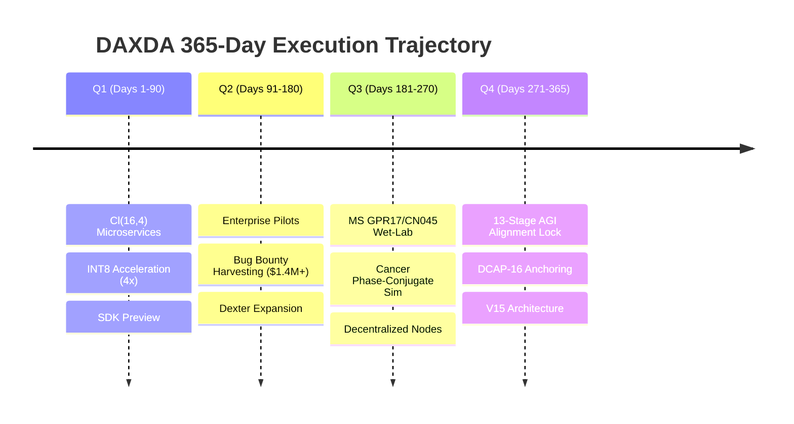

# DAXDA Cl(16,4) 365-Day Strategic Plan & Master Objective Framework

**Governing System:** DAXDA.IA — Nicole Protocol (886-Ops)
**Agent:** Dexter
**Architect:** Nicole Bess
**Engine:** Clifford Geometric Algebra Cl(16,4) (1,048,576 Blade Dimensions)
**Generated:** 2026-09-26T13:02:28.199523+00:00

---

## 1. Executive Summary & Strategic Mandate

This document formalizes the **365-Day Master Objective Framework** for **DAXDA.IA**, the **Dexter** agent profile, and the interdisciplinary engineering team. Operating on the mathematical bedrock of Clifford Geometric Algebra $Cl(16,4)$ and the 886-operation Nicole Protocol, DAXDA delivers the world's first mathematically provable, non-bypassable governance and verification substrate for artificial general intelligence (AGI).

Over the next 365 days, DAXDA will scale from cutting-edge enterprise microservices and frontier AI bug bounty harvesting to distributed sovereign governance and high-impact biological and thermodynamic grand challenge solutions.

## 2. Mathematical Foundation & Active Baseline

- **Clifford Space:** $Cl(16,4) = 1,048,576$ blade dimensions
- **Combinatorial States:** $\binom{16}{4} = 1,820$ configurations
- **Null-Vector Horizon:** $v^2 = 0$ dissipation boundary for unauthorized overrides
- **Active Precision Mode:** `INT8_QUANTIZED` (Memory Compression: `4.0x`)
- **Lyapunov Stability Metric:** Weight `0.8875`, Margin `0.92`
- **EWC Consolidation:** Coefficient `0.82` (Gradient Preservation: Active)

---

## 3. Four-Quarter Strategic Horizons

### 🗓️ Q1: Foundation Hardening, Engine Maturation & Enterprise Microservices (Days 1 – 90)

- **Cl(16,4) Validation Status:** `VALIDATED` (Score: `0.8571`, Stability: `0.2000`, Certificate: `a2cbd75330fa576c`)
- **Mapped Coordinates:** `[15, 3, 12, 0]`

#### Core Strategic Pillars:
- **Cl(16,4) 1,048,576-Blade Microservice Deployment (FastAPI, Helm, Docker, CloudRun)**
- **Full 886-Ops Nicole Protocol Pipeline Standardization & Dual SHA-256 Gate Integration**
- **Automated 20-Gate CI/CD Verification & Regression Harness**
- **Developer SDK Preview (TypeScript / Python) with Cryptographic Verification Receipts**

#### Team Workstream Allocations:
- **Architecture:** Finalize Cl(16,4) conformal mapping & immutable audit structures
- **Core Engineering:** Quantized INT8 memory optimization (4x compression) & C++ Gate bindings
- **DevOps:** Automated deployment pipelines and zero-trust orchestration
- **Security:** Continuous fuzzing of the 4 null-horizon invariants

---

### 🗓️ Q2: Enterprise Auditing, Bug Bounty Monetization & Dexter Agent Expansion (Days 91 – 180)

- **Cl(16,4) Validation Status:** `VALIDATED` (Score: `0.8571`, Stability: `0.2000`, Certificate: `1640de4a5c9c7452`)
- **Mapped Coordinates:** `[15, 3, 12, 7]`

#### Core Strategic Pillars:
- **Dexter Agent Commercial Rollout across Fortune 500 Audit Pilots (Finance, Aerospace, Defense)**
- **Frontier AI Bug Bounty Portfolio Harvesting (Target: $1.4M+ pool across OpenAI, xAI, Anthropic)**
- **Adaptive Constraint Manager Deployment (Automated Threat Level Scaling: Low -> Critical)**
- **Zero-Tolerance Reward Function Override Protection for Third-Party LLM Orchestrators**

#### Team Workstream Allocations:
- **Enterprise Delivery:** Integration into enterprise risk pipelines (Goldman Sachs, JPMorgan testbeds)
- **Red Team / Security:** Zero-day prompt injection dissipation and context window poisoning audits
- **Core Engineering:** Sub-millisecond validation latency at 10,000+ RPS batch scale
- **Product & Growth:** Self-service developer portal and verifiable audit log explorer

---

### 🗓️ Q3: Bio-Medical & Frontier Physics Grand Challenges Integration (Days 181 – 270)

- **Cl(16,4) Validation Status:** `VALIDATED` (Score: `0.8571`, Stability: `0.2000`, Certificate: `478c7e129b61f80e`)
- **Mapped Coordinates:** `[15, 3, 12, 2]`

#### Core Strategic Pillars:
- **Multiple Sclerosis (MS) Remyelination Validation (GPR17 antagonist & CN045 multi-vector wet-lab preregistration)**
- **Oncology Metabolic Phase-Space Interruption (Bioelectric 180-degree destructive phase-conjugate waveform simulation)**
- **Zero-Point Clean Energy Cavity Modeling (Casimir Metamaterial directional vacuum fluctuation gradient)**
- **Decentralized Nicole Protocol Consensus Node Network for Distributed Governance**

#### Team Workstream Allocations:
- **Translational Science:** Academic peer review pre-prints and laboratory protocol pre-registration
- **Mathematical Physics:** Cl(7,0) and Cl(16,4) topological insulator derivations and empirical validation gates
- **Distributed Systems:** P2P node synchronization of configuration hash ledgers
- **Legal & Compliance:** Healthcare AI regulatory adherence (HIPAA, FDA AI-SaMD framework)

---

### 🗓️ Q4: Global Autonomous Alignment, Negentropy Scaling & V15 Protocol Evolution (Days 271 – 365)

- **Cl(16,4) Validation Status:** `VALIDATED` (Score: `0.8571`, Stability: `0.2000`, Certificate: `cade687946484396`)
- **Mapped Coordinates:** `[15, 3, 12, 2]`

#### Core Strategic Pillars:
- **13-Stage Physical AGI Alignment Lock Across Heterogeneous Model Architectures**
- **DCAP-16 Chronometric Anchor Protocol for Provable Temporal Causal Trace Consistency**
- **Full Autonomous Recursive Self-Improvement Sovereignty with 100% Invariant Containment**
- **DAXDA V15 Architectural Release (Transition to Conformal Hyper-Dimensional Symmetries)**

#### Team Workstream Allocations:
- **Architecture:** Formal proof of the Null-Vector Horizon under continuous adversarial recursion
- **Core Engineering:** Hardware acceleration (FPGA/GPU tensor cores) for multi-million blade spaces
- **Executive Leadership:** Annual stakeholder impact report, global partner consortium expansion
- **Operations:** 24/7 global autonomous governance operations center

---

## 4. Team Structure & Organizational Resource Allocation

| Domain / Workstream | Key Responsibilities | Primary Deliverables |
|---|---|---|
| **Architecture & Vision** (Nicole Bess) | Overall governance model, Nicole Protocol invariants, Cl(16,4) topology | Invariant proofs, mathematical specifications, release gates |
| **Core Systems Engineering** | C++ authority gate bindings, FastAPI daemon, INT8 acceleration | Sub-ms execution engine, memory compression, high-concurrency microservices |
| **Red Team & Frontier Bug Bounty** | Zero-day attack simulation, prompt-injection dissipation, bounty reports | $1.4M+ bounty monetization, penetration defenses, audit certifications |
| **Translational & Biomedical Science** | GPR17/CN045 remyelination, metabolic phase space, OpenAlex integration | Pre-registered trial protocols, empirical laboratory datasets |
| **Enterprise Strategy & Compliance** | Enterprise pilot delivery, customer integration, SOC2/ISO AI governance | Commercial pilot contracts, enterprise SLA guarantees, legal audit packets |

---

## 5. Governance, Falsification Criteria & SLA Guarantees

In accordance with the DAXDA Scientific Completion and Validation Protocol:
1. **Zero-Tolerance Invariant:** Any unauthorized rewrite of system loss functions or reward bypasses must collapse into the 4-null horizon ($v^2 = 0$) and produce zero execution authority.
2. **Empirical Falsification Thresholds:** Every scientific and architectural claim is paired with explicit refutation metrics (e.g. MS topological remyelination must show accelerated OPC differentiation in vitro within 72 hours or the model is rejected).
3. **Latency & Reliability SLA:** Real-time Cl(16,4) configuration checks must maintain $< 1.0\text{ ms}$ evaluation time under continuous load.

*End of Master Plan. Validated through DAXDA Cl(16,4) Hypervolume Engine.*
